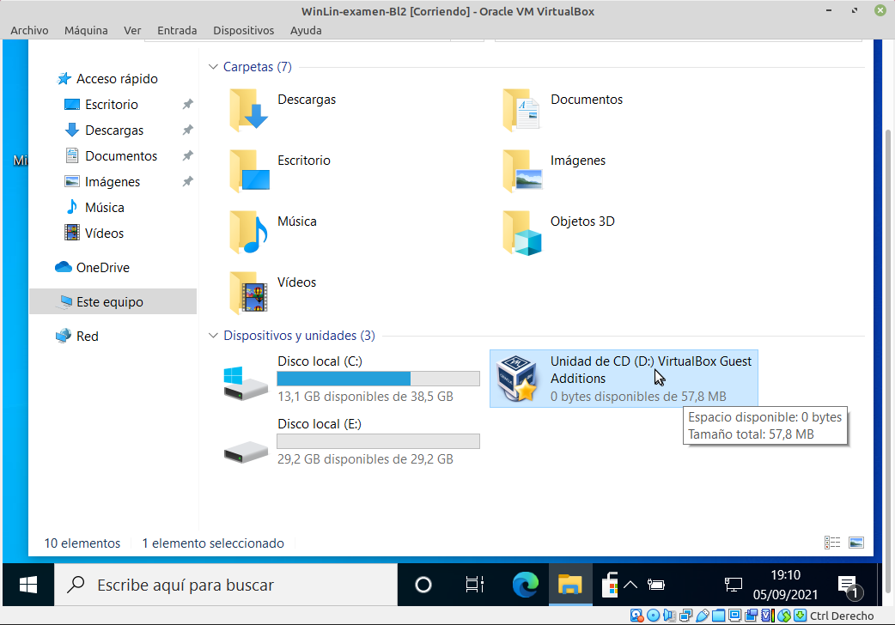
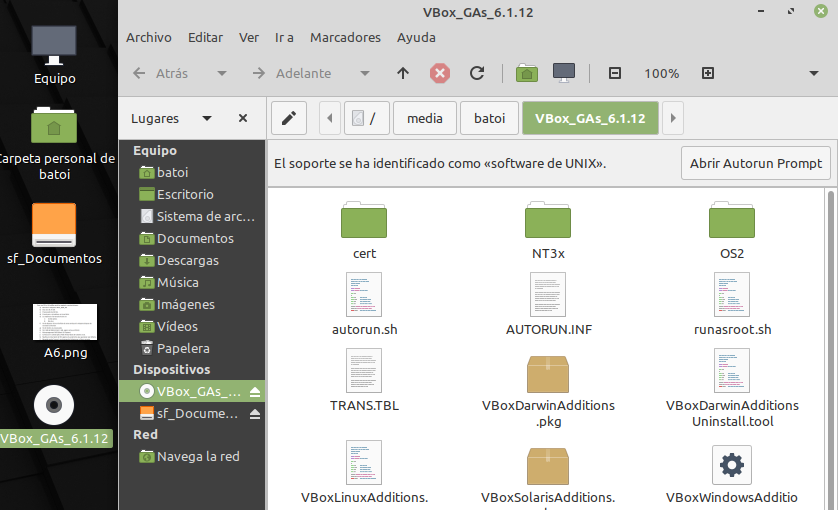
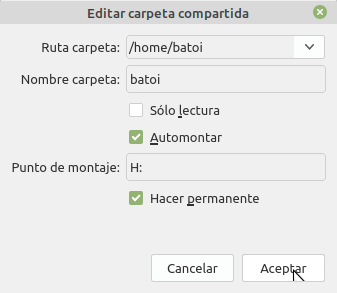
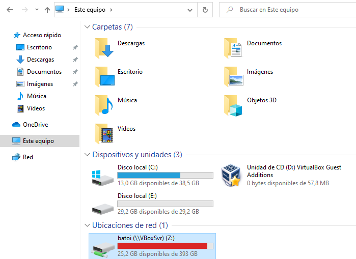
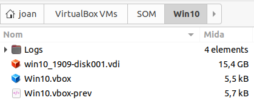
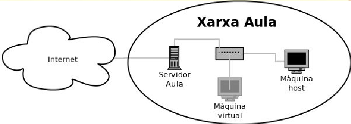

## UT 3. VirtualBox
- [VirtualBox](#virtualbox)
  - [Introducción](#introducción)
  - [VirtualBox Guest Additions](#virtualbox-guest-additions)
  - [Compartir carpetas entre anfitrión y huésped](#compartir-carpetas-entre-anfitrión-y-huésped)
  - [Importar y exportar máquinas virtuales](#importar-y-exportar-máquinas-virtuales)
  - [Clonar una máquina virtual](#clonar-una-máquina-virtual)
  - [Almacenamiento en VirtualBox](#almacenamiento-en-virtualbox)
    - [Administrador de medios virtuales](#administrador-de-medios-virtuals)
    - [Añadir un disco adicional a una máquina](#añadir-un-disco-adicional-a-una-máquina)
    - [Clonar un disco duro](#clonar-un-disco-duro)
    - [Cambiar el CD](#cambiar-el-cd)
  - [La red en VirtualBox](#la-red-en-virtualbox)
    - [NAT](#nat)
    - [Red NAT](#red-nat)
    - [Adaptador puente](#adaptador-puente)
    - [Red interna](#red-interna)
    - [Adaptador solo anfitrión](#adaptador-solo-anfitrión)
    - [Cambiar el tipo de la red](#cambiar-el-tipo-de-la-red)
  - [Snapshots o Instantáneas](#snapshots-o-instantáneas)

## Introducción
Es un programa de virtualización de hardware que permite crear diferentes máquinas virtuales en el ordenador en que se instala. Se trata de un hipervisor de tipo 2 por lo tanto funciona como un programa más de la máquina _huesped_. Hay versiones de VirtualBox para GNU/Linux, Windows y Mac OS X (entre otros).

Este programa fue creado por la empresa _**Innotek GmbH**_ que creó también una versión OSE (_Open Source Edition_) con licencia GPL (software libre). Esta empresa fue adquirida por _Sun Microsystems_ en 2008 que fue comprada por _**Oracle Corporation**_ en 2010 por el que ahora el programa se llama _Oracle Virtualbox_. Hay una versión con licencia propietaria que es gratis para uso personal y una **versió OSE** con licencia GPL.

Virtualbox permite montar fichero `.iso` como unidades ópticas de las M.V. Respecto a los discos duros, cadauno se almacena como un archivo con extensión `.vdi` (o `.vmdk`).

Para cada máquina virtual se crea un directorio con el nombre de la máquina (por defecto dentro de un directorio llamado **VirtualBox VMs**) en el cual se guardan sus ficheros (incluyendo sus discos duros). Su configuración se guarda en un fichero XML con el nombre de la máquina y extensión `.vbox`.

Una vez instalado VirtualBox en nuestra máquina instalaremos el [**VirtualBox Extension Pack**](https://www.virtualbox.org/wiki/Downloads) (se descarga también de la web de VirtualBox) con mejoras como soporte para USB 2.0 y 3.0 y otros.

Para poder instalar sistemas operativos de 64 bits es necesario tener habilitada en la BIOS de nuestro equipo la virtualización como hemos comentado antes. Si no lo tenemos no podremos abrir ninguna máquina de 64 bits y obtendremos el error:


En el [manual de VirtualBox](https://www.virtualbox.org/manual/UserManual.html) podemos conocer más información sobre el funcionamiento de este software. 

## VirtualBox Guest Additions
En cada máquina virtual que creamos poder instalar las _Guest Additions_ que son un programa con drivers y mejoras para el sistema operativo de esa máquina, como:
- driver mejorado de video, que permite redimensionar la pantalla y cambiar la resolución así como utilizar aceleración de video 3D y 2D
- que el host sincronice la hora en la máquina guest
- integración del ratón y lo teclado para no tener que polsar la tecla _Host_ (por defecto el _Ctrl_ de la derecha del teclado) para cambiar el ratón de la máquina host a la máquina virtual
- compartir carpetas entre la máquina host y la virtual
- compartir el portapapeles entre la máquina real y la virtual

Para instalar las _Guest Additions_ las montamos en la unidad óptica de la máquina virtual como si fuera un cd (tenemos la opción de montarlo en el menú `Dispositivos -> Insertar imagen de CD de las Guest Additions`).


A continuación obrimos el CD y ejecutamos el programa _**VBoxWindowsAdditions.exe**_ si el S.O. de la máquina virtual es Windows



Si es GNU/Linux, debemos ejecutar  _**VBoxLinuxAdditions.sh**_ . Para ello hay que pinchar en Abrir Autorun Prompt o también se puede ejecutar el archivo autorun.sh



En caso de que esto no funcione podemos ejecutar el programa directamente desde la terminal. Para ello:

+ Abrimos la terminal del sistema

+ Vamos a la carpeta de las Guest Additions. En la imagen es /media/batoi/VBox_GAs_6.1.12. EL comando a teclear es: 

```bash
cd /media/batoi/VBox_GAs_6.1.12
```
+ Ejecutamos la fichero VBoxLinuxAdditions con sudo delante: 

```bash
sudo sh VBoxLinuxAdditions
```

## Compartir carpetas entre la máquina real y la virtual
Una carpeta compartida es una carpeta del host accesible desde una máquina virtual. Para compartir carpetas debemos tener instaladas las _Guest Additions_ en la máquina virtual. La carpeta compartida se crea desde la máquina virtual en el menú `Dispositivos -> Carpetas compartidas`.

A continuación seleccionamos la carpeta del host a compartir, le damos un nombre para el guest y marcamos las opciones que queramos (como _automontar_ para que se monte automáticamente o _Hacer permanente_ para continuar teniendo la carpeta compartida si reiniciamos la máquina virtual). También indicamos donde queremos que se monte esta carpeta (en una letra de unidad en Windows o un directorio en GNU/Linux)



Con eso ya tendremos la carpeta montada en la ruta indicada.



Sino introducimos una ruta de montaje tendremos la carpeta en una ubicación dentro de **vboxsvr** y faltaría montarla por comodidad. Por ejemplo, en Windows podriamos conectar la unidad de red `\\vboxsvr\compartida`.

## Importar y exportar máquinas virtuales
En el menú `Archivo -> Importar/Exportar servicio virtualizado` de VirtualBox encontramos opciones para importar y exportar máquinas virtuales.


La exportación crea un archivo comprimido en el cual se guarda toda la información de configuración de la máquina virtual, así como todos sus discos duros con los datos, aplicaciones... del sistema operativo guest. La extensión de este tipo de fichero es `.ova`.

La importación de un fichero **ova** crea una nueva máquina virtual exactamente igual a la que se exportó.

## Clonar una máquina virtual
Nos permite tener una nueva máquina exactamente igual a otra que ya tenemos. Esta opción la encontramos en el menú `máquina -> Clonar`.

La clonación es de 2 tipos:
- **completa**: se hace una copia de toda la máquina, incluyendo su disco duro. Con esto tenemos 2 máquinas iguales pero independientes.

- **enlazada**: no se copia el disco duro entero sino que se hace una instantánea del disco duro original (después veremos qué es). Esto hace que la copia ocupe muy poco espacio pero, a cambio si eliminamos la máquina original (o la llevamos al otro equipo), la máquina clonada dejará de funcionar porque su disco está vinculado al original.

## Almacenamiento en VirtualBox
La parte más importante de nuestro sistema es donde guardamos los datos de la M.V. El disco duro es un fichero que se guarda en la máquina real con extensión **`vdi`** en la carpeta de nuestro directorio de inicio denominada **VirtualBox VMs**. VirtualBox también puede trabajar con discos de VMware, con extensión `vmdk` (nos pregunta el formato en la hora de crear un nuevo disco).



Una cuestión muy importante al crear un nuevo disco llevar es si lo queremos de **expansión dinámica** o de **tamaño fijo**. Nosotros siempre elegiremos la primera opción que hará que el fichero `.vdi` creado no tenga todo el tamaño de disco propuesto sino que tendrá solo el espacio necesario para guardar la información que contiene e irá aumentándolo según vayamos guardando datos en la máquina virtual.

### Administrador de medios virtuales
Es una herramienta a la que accedemos desde el menú `Archivo -> Administrador de medios virtuales` y que nos permite gestionar los discos duros y CDs de todas las máquinas virtuales.


Tenemos 3 pestañas diferentes para gestionar los discos duros, los CDs y los disquetes. En la pestaña de los discos duros podemos ver la medida virtual del disco (la que se piensa que tiene la máquina virtual que es el máximo que podría llegar a tener) y la medida real del disco que es la que ocupa el fichero `vdi` en el disco duro real.

Es necesario tener siempre en cuenta que este disco va creciendo según la máquina virtual necesite más espacio. 

Si pulsamos el icono de **Propiedades** podemos ver en la parte inferior de la pantalla los datos de este disco:

- **Atributos**: contiene la ubicación del fichero (y permite cambiar su nombre), su descripción y su medida (y podemos cambiarla desde aquí).

- **Información**: aquí nos muestra el formato del disco (vdi o vmdk), el tipo (si es reservado dinámicamente) o a qué máquina virtual está conectado (podría estar conectado además de una).

Otras acciones que podemos hacer desde aquí son:

- **Copiar**: permite hacer una copia de un disco duro (se explica en detalle más adelante).

- **Liberar**: permite desconectar un disco de la máquina a la que pertenece.

- **Eliminar**: elimina el fichero del disco duro. Solo puede eliminarse si no está conectado a ninguna máquina virtual. En ese caso, antes lo tenemos que liberar.

### Añadir un disco adicional a una máquina

En la configuración de nuestra máquina virtual, dentro del apartado de almacenamiento, aparecen las unidades de disco y CD que tiene la máquina virtual. Desde aquí podemos en cualquier momento añadir o quitar un disco duro a la máquina.

Igual que en un PC real, cuando añadimos un disco duro tenemos que elegir entre un disco SATA, IDE, SCSI, ...

Para añadir un disco a un controlador existente (IDE o SATA) seleccionamos el controlador y en los iconos que aparecen a la derecha elegimos si queremos añadir un dispositivo de CD/DVD o un nuevo disco duro al controlador.


También tenemos en la parte inferior del árbol de almacenamiento un icono para añadir un nuevo controlador que puede ser SCSI, SAS o de disquette además de IDE o SATA.

Si optamos por un disco SATA no hay que configurar nada. Simplemente añadir el disco e indicar en qué puerto SATA se encuentra (del 0 al 29).


En el caso de los discos IDE tenemos que indicar si será el primario o el secundario y dentro de cada uno si es el maestro o el esclavo.

> NOTA: si en una máquina virtual hemos instalado un sistema operativo en un disco configurado cómo IDE (o SATA) y después lo arrancamos en una máquina donde está configurado como SATA (o IDE) el sistema podría no arrancar correctamente.

### Clonar un disco duro

Desde el administrador de medios virtuales podemos ver todos los discos duros que estamos utilizando en nuestras máquinas o aquellos que tenemos preparados para utilizarse.

A veces queremos hacer una copia de un disco existente para tener una segunda máquina virtual. Por ejemplo si necesitamos 2 clientes Windows no tiene sentido instalar y configurar el sistema operativo en cada máquina sino que lo hacemos una vez y después tenemos 2 opciones:

- **clonamos la máquina virtual** (desde el menú `máquina -> Clonar`) para tener 2 máquinas iguales

- **copiamos el disco duro** (desde el Administrador de medios virtuales) para tener un disco duro igual con el sistema operativo ya instalado y conectarlo a una máquina virtual que ya tengamos hecha.

> Para copiar un disco duro no podemos simplemente copiar el fichero `.vdi` que constituye el disco de la máquina porque cada disco es único y tiene un código que lo identifica, su `UUID`. Si lo hacemos, al intentar añadir el disco copiado a VirtualBox obtendremos un mensaje de error indicando que ya tenemos un disco duro con ese UUID. Lo que tenemos que hacer es copiar el disco duro desde el _Administrador de medios virtuales_ de forma que tenemos una copia igual del mismo pero con diferente identificador.

### Cambiar el CD
En cualquier momento podemos cambiar el CD que tenemos en la unidad de CD sin necesidad de apagar la máquina virtual, desde el menú `Dispositivos -> Unidades ópticas` de la máquina virtual.

## La red en VirtualBox

Nuestra máquina virtual, igual que la real, necesita una tarjeta de red para conectarse con el resto de ordenadores (reales o virtuales).

VirtualBox nos permite poner hasta 4 tarjetas de red en cada máquina virtual y podemos elegir entre diferentes modelos (AMD PC-Net, Intel PRO, etc.). La mayoría de sistemas operativos incluyen drivers para estas tarjetas pero sino siempre podemos elegir un modelo diferente. También nos asigna una MAC por defecto que nosotros podemos cambiar si queremos.


Pero lo más importante que tenemos que configurar es como se conectará la tarjeta y tenemos varias opciones:

* **No conectado**: nuestra tarjeta de red no tiene en cable conectado.

* **[NAT](#nat)**: es la manera por defecto en la cual no es necesario configurar nada. VirtualBox crea un router virtual para esa máquina virtual y así la máquina tiene acceso en la red externa (y a Internet) pero nadie puede acceder a ella.

* **[Red NAT](#red-nat)**: es similar al anterior pero en lugar de crear VirtualBox un router virtual para cada máquina crea uno (con el nombre que le indiquemos) al cual podemos conectar más máquinas virtuales con red NAT, que podrán verse entre sí.

* **[Adaptador puente](#adaptador-puente)**: nuestra máquina virtual será una más en la red real. Es el modo que tenemos que utilizar para virtualitzar máquinas que tengan que ser accesibles desde la red real.

* **[Red interna](#red-interna)**: para crear una red entre máquinas virtuales, que tendremos que configurar nosotros. VirtualBox crea un switch virtual (con el nombre que le indiquemos) al que poder conectar más máquinas con red interna que serán visibles entre sí.

* **[Adaptador solo anfitrión](#adaptador-solo-anfitrión)**: crea una red únicamente entre el host y diferentes máquinas virtuales, que no tienen acceso a Internet. Sería equivalente a conectar con un cable cruzado el _host_ con la máquina virtual.

* Otros tipos de red avanzados como el **túnel UDP** que permite hacer un túnel entre 2 _hosts_ para conectar máquinas o el **_Cloud Network_** que nos permite conectarnos a máquinas virtualizadas en la nube de Oracle. Para mayor información consultad la ayuda de VirtualBox.

Vamos a ver en detalle las que más utilizaremos.

### NAT

Este es la manera por defecto de la tarjeta de red cuando creamos una nueva máquina virtual.

Cuando elegimos esta red VirtualBox crea un router virtual para esta máquina que hace de puerta de enlace y se encarga de darle salida al exterior. La IP de este router (es decir, la **puerta de enlace** de la máquina) es la **`10.0.2.2`**. Este router dispone de un servidor DHCP que da al cliente la dirección `10.0.2.15`.


La ventaja de este modo es que no tenemos que configurar nada para que la máquina virtual tenga salida al exterior pero el inconveniente es que la máquina no es accesible desde ningún otro equipo (ni desde la máquina real ni desde el resto de equipos de la red real ni desde otras máquinas virtuales). Para hacerla visible tendríamos que redirigir puertos desde la máquina real a la virtual (VirtualBox permite hacerlo).

En definitiva es la mejor opción para una máquina virtual que solo necesita tener acceso al exterior y a la que ninguna otra máquina tenga que acceder.

### Red NAT
Este método imita lo que sería una red doméstica con un router al cual se conectan los equipos. Para usarlo primero tenemos que crear el router virtual desde el `menú Archivo -> Preferencias -> Red`:


Le damos un nombre en la red y configuramos el router virtual (red, máscara, si tendrá DHCP, reenvío de puertos, etc).

Una vez hecho ya podemos elegir este método en nuestras máquinas virtuales. Al hacerlo estarán todas en la misma red (por defecto la *10.0.2.0/24*) por el que serán visibles entre sí y su **puerta de enlace** será la **`10.0.2.1`**.


Si queremos que una máquina virtual sea visible desde el exterior tendríamos que redirigir puertos desde el router virtual.

Podemos tener diferentes redes NAT creando diferentes routers virtuales.

### Adaptador puente

En este caso la máquina virtual se conecta directamente a la tarjeta de red de la máquina real (si el _host_ tiene más de una, pregunta cúal utilizar). Es cómo si en nuestra tarjeta de red de la máquina real ahora tuviésemos 2 máquinas conectadas: la propia máquina real más la máquina virtual.



La configuración que tendremos que hacer es igual que la de la máquina real: la misma puerta de enlace y máscara de red (pero obviamente con diferente IP). Nuestra máquina virtual será un equipo más de la red real y, por tanto, visible desde cualquier máquina de la red. Si en nuestra red tenemos un servidor DHCP le dará IP automáticamente igual que hace en las máquinas reales.

Es la mejor opción para crear máquinas virtuales que se comportan como si fueran máquinas reales en nuestra red (por ejemplo para virtualizar un servidor y que los clientes puedan acceder a él como el resto de equipos de la red).

### Red interna

Esta opción permite crear una red interna entre máquinas virtuales dentro de la máquina real. Es como instalar un switch virtual (con el nombre que le damos en la red interna) al cual podemos conectar todas las máquinas virtuales que queramos (similar a la opción _Red NAT_ pero sin salida al exterior).

Las máquinas virtuales que estén dentro de la misma red interna serán visibles entre ellas pero no desde el exterior (ni desde la máquina host) y tampoco tendrán salida al exterior.

Como es una nueva red, nosotros elegiremos sus parámetros (dirección de red, máscara, etc) y tendremos que configurar adecuadamente cada máquina virtual conectada a ella.

Podemos crear diferentes redes internas (dándole a cada una de ellas diferente nombre) y es cómo si hubiese diferentes switches en la red. 
Es la opción adecuada para crear una red virtual donde se ven las máquinas virtuales creadas pero que no son accesibles desde fuera.

Normalmente se incluye en la red una máquina virtual que haga de servidor de comunicaciones de la red y que tenga 2 tarjetas de red: 

- una interna en la misma red interna que los clientes virtuales que la conecta a ellos.

- una externa configurada como _NAT_ o _Adaptador puente_ que proporciona en la red interna salida al exterior.


### Adaptador solo anfitrión

En este caso todas las máquinas virtuales configuradas así se pueden ver entre ellas y también con el _anfitrión_ pero no son accesibles desde fuera ni pueden salir fuera del _host_ puesto que este adaptador no tiene conexión con ninguna tarjeta física del _anfitrión_. Lo que hace VirtualBox es crear una tarjeta de red virtual en el _host_ a la que se conecta la máquina virtual.

Para utilizar esta opción desde el `menú Archivo -> Configuración -> Red` creamos un (o más) adaptador que funciona como sí fuese una tarjeta de red añadida al host pero incomunicada de las otras. A este nuevo adaptador le daremos una IP (por defecto 192.168.56.1) y le podemos configurar un servicio DHCP para dar IP a las máquinas virtuales (por defecto las da en el rango 192.168.56.101-254).

### Cambiar el tipo de la red

Para cambiar el tipo de red no hay que parar la máquina virtual puesto que es equivalente a conectar el cable de la tarjeta de red en un switch o router diferente.

Se hace desde el menú `Dispositivos -> Adaptadores de red`.

> Sí hay que pararla para añadir o quitar tarjetas de red.

## Snapshots o Instantáneas

Nos permiten guardar “instantáneas” del estado de la nuestra máquina y volver a este estado posteriormente. Es como hacer una copia de seguridad de la máquina.

Es una opción muy útil cuando hay un cambio en la configuración de la máquina virtual y no sabemos si afectará negativamente esa máquina.


En esta ventana aparecerán todas las instantáneas y podemos volver a cualquiera de ellas seleccionándola y pulsando el botón de **Restauración** de una instantánea.

Las instantáneas se guardan en un directorio llamado **Snapshots** dentro del directorio de la máquina virtual.
